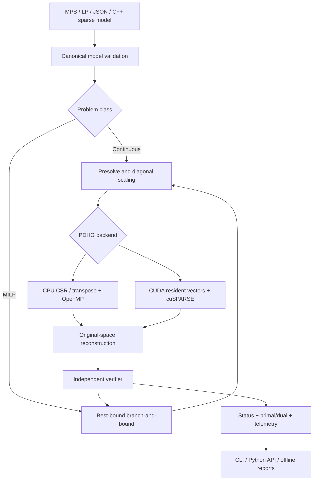

# Architecture

`include/vantage/vantage.hpp` defines the public sparse model, options, results and API. `src/internal.hpp` defines reversible preparation and a backend interface. The CUDA backend owns device buffers, sparse descriptors and its cuSPARSE handle through RAII. There is no global model or optimization-engine state; a process-level signal flag implements CLI interruption. OpenMP thread configuration is process-level, so concurrent C++ calls with different thread settings are not a supported concurrency contract yet.

The canonical minimization objective is `0.5 sum(q[j]*x[j]^2) + c*x + offset`. `sense` records how to recover an original maximization objective. Bounds are explicit intervals, and integrality is independent of continuous storage. Sparse dimensions and indices are signed 64-bit. The solver never densifies the constraint matrix.

CPU and CUDA implement the same primal/dual update ordering and averaging. The host owns restart decisions and periodically checks original-space solutions. An explicit transpose avoids nondeterministic transpose scatter operations. CUDA device memory is estimated before allocation; CUDA/cuSPARSE calls and kernel launches are checked. GPU execution is currently one relaxation at a time.

Preprocessing has an explicit old/new row and column mapping, fixed values and scaling factors. Variable reconstruction is `x_original = D_c x_scaled`, and dual reconstruction is `y_original = objective_scale * D_r y_scaled`. Eliminated row multipliers are zero. Eliminated fixed/isolated columns remain governed by their original box in verification.

The MILP queue stores bound vectors and warm-start vectors. The sparse matrix is reused, but bound storage is O(variables) per node; a persistent bound-change representation is Phase 2 work. Unresolved leaves remain in global-bound accounting. The iteration objective never substitutes for a lower bound.

The benchmark process is outside the solver library and Python product API. It can launch HiGHS in a different process. CMake does not discover, link or download any third-party optimization engine.
