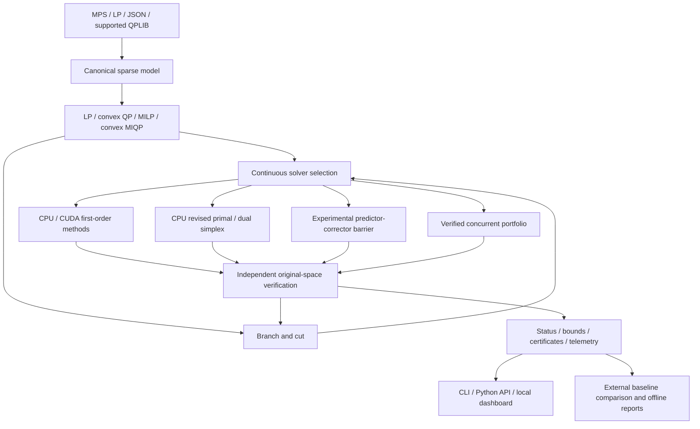

# Current architecture

NIRYUKTI is the application identity; VANTAGE is the C++ library/binary namespace. The solver core is independent of existing optimization engines. Eigen and CUDA/cuSPARSE provide numerical infrastructure only.

The public model stores `0.5*xᵀQ*x + cᵀx + offset`, interval row/variable bounds and independent variable types. Q includes diagonal shorthand and a symmetric sparse matrix. Original objective sense is restored in output. Sparse dimensions/indices use signed 64-bit host storage; CUDA selects checked 32-bit or 64-bit device index paths. The constraint matrix is never densified by numerical iteration.

`src/internal.hpp` defines reversible preparation and the iteration backend interface. Fixed/isolated columns, row mapping, endpoint-provider mapping and scaling factors reconstruct original-space candidates. Exact parallel-row merging preserves which original endpoint supplies a multiplier. A verifier owns a cached transpose and scratch workspace over an immutable original model.

CPU/CUDA first-order backends own accepted/trial vectors, averages, anchors and adaptive state. CUDA's thread-local reusable matrix context retains immutable exact-matched device matrices/descriptors and a stream/handle; iterative buffers remain RAII-managed. Device reductions/graph execution can reduce host overhead, but host time/control/restart decisions and some candidate downloads remain. Directed GPU integer propagation does not perform full model compaction. Batched LP probes share a sparse matrix through SpMM and independently verify final candidates.

The experimental barrier owns sparse KKT assembly and optimizer mathematics. CPU uses sparse numerical LU; CUDA uses sparse BiCGSTAB for Newton directions, with CPU KKT assembly and independent residual checks. The verified portfolio has a local cancellation token and joins workers before returning. CLI SIGINT is process-level. Concurrent method/thread allocation remains an experimental contract.

Integer nodes retain sparse bound changes plus optional dense primal/dual/basis warm starts. Bound arrays are materialized for the active node. Warm-start memory can still become significant on large trees. Root/local/global restricted cut pools and binary conflicts have separate validity scopes; neighborhood heuristics cannot contribute unsafe global bounds. Queue, unresolved and closed leaf bounds remain in global-gap accounting.

State continuation is explicit: first-order snapshots include actual backend/host iterate state; MIP snapshots include tree/frontier/search state. Atomic local file replacement prevents partial snapshots. Model/backend/configuration matching is mandatory. Checkpoints are trusted local state, not independent proofs.

The local dashboard isolates CLI and external benchmark processes, bounds requests, supports process-group cancellation and protects mutations with a session token. Benchmark pages read small CSV summaries; large solution vectors are previewed in APIs while complete downloads remain available. Benchmark adapters for HiGHS/default-IPM and SCIP live outside the product solving path. Exact measured source/binary hashes and failed runs are retained.

See [algorithm details](algorithms.md), [current limits and validation](solver_completion_20260927.md), and [stress methodology](stress_campaign_20260927.md).
