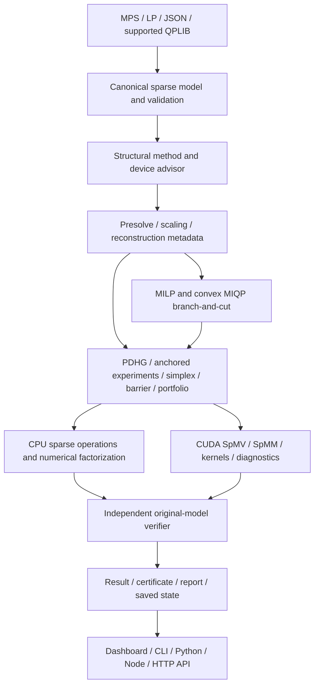

# NIRYUKTI — complete implemented-feature and mathematics reference

**Audit date:** 28 September 2026. **Release:** 0.2.2.
**Solver implementation checkpoint:** `460b703`; package source: `3930284`.
This document inventories the inspected implementation, including opt-in research
paths. It separates implemented behavior, tested evidence and remaining limits.
It is the technical reference for the [full demo walkthrough](complete_demo_walkthrough.md).

NIRYUKTI is the current product/package/CLI name. `vantage` namespaces, modules,
executable aliases and environment variables remain for compatibility. Those
internal names refer to the same independent engine, not another solver.

## Contents

1. [Product and architecture](#1-product-and-architecture)
2. [Complete feature inventory](#2-complete-feature-inventory)
3. [Mathematical formulation and continuous algorithms](#3-mathematical-formulation-and-continuous-algorithms)
4. [Integer optimization, cuts and conflicts](#4-integer-optimization-cuts-and-conflicts)
5. [Verification, evidence and numerical safeguards](#5-verification-evidence-and-numerical-safeguards)
6. [Industrial planning mathematics](#6-industrial-planning-mathematics)
7. [Interfaces, dashboard and distribution](#7-interfaces-dashboard-and-distribution)
8. [Validation and measured evidence](#8-validation-and-measured-evidence)
9. [Honest limits and presentation claims](#9-honest-limits-and-presentation-claims)
10. [Research papers and implementation relationships](#10-research-papers-and-implementation-relationships)

## 1. Product and architecture

The core supports LP, supported convex QP, MILP and convex MIQP through a common
sparse model and independent verification. It includes multiple continuous engines,
CPU/NVIDIA execution, integer search, industrial examples, a local dashboard,
CLI, Python/Node interfaces, a C ABI, local HTTP API and offline reporting.

The core does not call HiGHS, SCIP, CBC, CPLEX, Gurobi or another optimizer to
solve a user model. Numerical infrastructure is allowed: Eigen sparse numerical
factorization, OpenMP, CUDA, cuSPARSE and CUB. External optimizers belong to the
comparison harness only. [Dependency scanner](../scripts/check_dependencies.py)
and [policy](dependency_policy.md) document this boundary.

## 2. Complete feature inventory

“Implemented” describes a working code path, not a claim of unrestricted support
or mature industrial robustness. Research paths are selectable and tested but
remain guarded. The identifiers also organize the demonstration chapters.

### Models, input and preprocessing

| ID | Implemented feature | Scope and source |
|---|---|---|
| M01 | Canonical minimization model, original min/max display, constant objective offset | [Model](../include/vantage/vantage.hpp), [I/O](../src/io.cpp) |
| M02 | Sparse linear constraints with independent lower/upper endpoints | Equalities, one-sided and ranged rows; no dense A in iterative solving |
| M03 | Continuous, integer and binary variables; finite or infinite bounds | LP/QP/MILP/MIQP classification |
| M04 | Diagonal and full symmetric sparse quadratic objectives | Combined Hessian is `diag(q)+Q`; convexity validation required |
| M05 | COO assembly, duplicate coefficient aggregation, CSR products, explicit transpose | 64-bit canonical offsets/indices; [sparse implementation](../src/model.cpp) |
| M06 | Native JSON reader/writer and named variables/rows | Dimension, name, finite-data and bound validation |
| M07 | MPS linear/integer sections, ranges, integer markers and documented bound types | `QMATRIX` full symmetry and triangular `QUADOBJ`; useful subset, not every dialect |
| M08 | Conventional LP text subset and MPS/JSON conversion | Linear expressions, signs/scientific notation, bounds, integer sections |
| M09 | Native supported continuous QPLIB import | Linear/box constraints and convex QP; unsupported classes rejected |
| M10 | Malformed input rejection | NaNs, infinite coefficients, unknown names, mismatched dimensions and invalid bounds |
| M11 | Numerical PSD recognition | Small numerical checks, dominance/SPD paths and guarded sparse semidefinite elimination |
| M12 | AMD ordering for sparse singular-PSD elimination | Tested weighted-star structure; uncertainty/fill/operation limits remain explicit |
| P01 | Fixed-variable substitution and reconstruction | Rows, linear/quadratic objective and objective offset; [presolve](../src/preprocess.cpp) |
| P02 | Bounded isolated-column optimization and immediate special-case detection | Includes supported isolated unbounded directions; no general recession detector |
| P03 | Empty-row removal and infeasibility checks | Original-space reconstruction retained |
| P04 | Activity-interval contradiction detection and redundant-row removal | Conservative long-double arithmetic guards |
| P05 | Exact parallel-row intersection and dual endpoint provenance | Compatible rows only; not arbitrary aggregation |
| P06 | Integer-domain rounding and iterative node-bound propagation | Outward intervals and guarded exactly representable integer magnitudes |
| P07 | Ruiz infinity-norm equilibration and objective normalization | Factors stored and reversed before independent verification |
| P08 | Combined geometric-mean, Ruiz and Pock–Chambolle scaling | Opt-in; clipped factors and unsafe extra-transform rejection |
| P09 | GPU directed-rounding bound propagation | Continuous and integer proposals; persistent bounded workspace |
| P10 | Continuous bound derivation replay and dual reconstruction | Actual tighter LP/QP box, with proof DAG; [bound postsolve](../src/bound_postsolve.cpp) |
| P11 | CUDA retained-CSR count/scan/scatter compaction | Host selects reductions and builds provenance; CUDA compacts matrix entries |

The exact syntax and exclusions are in [supported formats](supported_formats.md).

### Continuous algorithms and selection

| ID | Implemented feature | Scope and source |
|---|---|---|
| A01 | Independent primal-dual hybrid gradient (PDHG) | [Controller](../src/solver.cpp), [CPU backend](../src/cpu.cpp) |
| A02 | Box projection and interval-support dual proximal update | LP and diagonal convex QP proximal path |
| A03 | Adaptive trial acceptance, finite checks and rejected-step rollback | CPU/CUDA share `E >= 2|C|` acceptance math |
| A04 | Step-weighted averaging and original-space candidate selection | Current and averaged iterates checked |
| A05 | Progress/epoch restarts and displacement primal weighting | Defaults remain inspectable and configurable |
| A06 | Halpern anchored LP experiment | CPU/CUDA continuous LP, `--no-adaptive`, FP64 matrix |
| A07 | Restarted/reflected Halpern variants | `rhpdhg` / `r2hpdhg`; own guarded research variants, not exact upstream reproductions |
| A08 | Safeguarded PID primal/dual weighting | Epoch displacement feedback, saturation and anti-windup |
| A09 | Power-iteration norm estimation | Estimate, not a certified upper bound; adaptive acceptance still required |
| A10 | LP feasibility polishing | Separate primal/dual feasibility subproblems and final recombination check |
| A11 | General sparse convex QP smooth splitting | Sparse Q*x; conservative smooth/primal-dual step condition; not branded PDHCG/rAPDHG |
| A12 | Two-phase revised primal simplex | Sparse structural columns, slack/surplus/artificial variables, phase I/II |
| A13 | Sparse basis factorization and product-form updates | Numerical refactorization, guarded recovery and degeneracy/Bland fallback |
| A14 | Compatible-basis revised dual simplex | Reoptimization after bound/RHS changes; cold fallback on incompatible/invalid basis |
| A15 | Predictor-corrector barrier/IPM | Own optimization algorithm; experimental, guarded KKT dimension/fill |
| A16 | CPU sparse Newton factorization and refinement | Numerical Eigen sparse LU; original-model acceptance |
| A17 | CUDA Newton linear solve | Own sparse BiCGSTAB numerical solve; host KKT assembly, not GPU direct factorization |
| A18 | Concurrent continuous portfolio | Cooperative race; first verified optimum wins; workers joined |
| A19 | Structure/hardware-aware automatic method selection and recovery | [Advisor](../src/advisor.cpp); simplex/barrier attempt may fall back to PDHG |
| A20 | Automatic CPU/CUDA selection and memory guard | Inspectable threshold policy, not trained ML or calibrated runtime prediction |
| A21 | Warm primal/dual vectors and compatible basis metadata | Named/fingerprint consistency; explicit allowance for parametric model changes |

### NVIDIA execution and numerical operation

| ID | Implemented feature | Scope and source |
|---|---|---|
| G01 | CUDA/cuSPARSE sparse products and fused vector kernels | [CUDA implementation](../src/cuda.cu) |
| G02 | Device-resident current/average/anchor vectors during iteration | Full vectors are not copied every accepted iteration |
| G03 | Device trial statistics, acceptance and finite-value checks | Host still controls monitoring/limits and parts of restart/weight logic |
| G04 | GPU scalar convergence diagnostics | Scaled monitoring defers some host checks; independent final CPU verification remains |
| G05 | Resident restart copies and activity rebasing | Resets averages/anchors without re-uploading the selected primal vector |
| G06 | CUDA Graph iteration execution | Opt-in; reduces launch overhead, no universal speedup claim |
| G07 | Persistent matrix/propagation contexts and pooled allocations | Bounded cache with model/device invalidation |
| G08 | Auto 32-bit GPU index path and 64-bit fallback | Canonical host model retains 64-bit storage |
| G09 | Mixed FP32 matrix / FP64 vector-compute experiment | Original FP64 verification; fixed Halpern operators reject mixed matrices |
| G10 | Batched LP strong-branching probes through SpMM | CUDA MILP + reliability branching; not batched MIQP or arbitrary concurrent node solving |
| G11 | CPU/OpenMP fallback and independent GPU availability reporting | CPU-only packages remain usable |
| G12 | CUDA errors, resource ownership, allocation checks and timing telemetry | Memory suitability estimates are not measured peak VRAM/utilization |

### Integer search, cuts and conflicts

| ID | Implemented feature | Scope and source |
|---|---|---|
| I01 | MILP branch-and-bound and convex MIQP QP relaxations | Own continuous engines; [tree](../src/mip.cpp) |
| I02 | Certified/conservative relaxation lower bounds for pruning | Never prune from an approximate primal objective |
| I03 | Bound-delta queued nodes and warm relaxation metadata | Avoids full bound-vector storage in the queued frontier; not zero-memory nodes |
| I04 | Most-fractional and reliability pseudocost branching | Limited strong probes; probe scores choose order, not proof |
| I05 | Best-bound, depth-first and best-estimate node ordering | Global bound calculation remains independent of ordering |
| I06 | Incumbent management and absolute/relative MIP gaps | Feasible incumbents retained at limits; unresolved leaves retained in bound accounting |
| I07 | Round-and-check and continuous repair | Rounded candidates independently checked |
| I08 | L1 feasibility pump | Bounded root projection attempts; not a full commercial pump |
| I09 | RINS restricted neighborhoods | Fix incumbent/LP agreement; shared budgets; neighborhood bounds stay local |
| I10 | Local branching neighborhoods | Hamming-distance neighborhood for binaries; separate bounded search |
| I11 | Restricted binary cover cuts | Positive integral knapsack rows and exact cover arithmetic |
| I12 | Restricted clique cuts | Compatible binary conflicts identified from eligible rows |
| I13 | Mixed-integer rounding cuts | Finite safe bound shifts; guarded coefficients and outward weakening |
| I14 | Integer-lattice/GCD row cuts | Pure-integer rows with exactly represented integral coefficients |
| I15 | Node-local cut rounds | Derived from node bounds, discarded outside that node |
| I16 | Capped global cut pool with efficacy, age and usage | Root-valid derivations; selected active cuts; no unrestricted separator catalog |
| I17 | Binary no-good conflicts and relaxation rows | Original-row replay minimizes explanations; unit propagation and subsumption |
| I18 | General bound-disjunction conflicts | General integers/continuous bounds; original-row contradiction replay and conservative complements |
| I19 | Persistent learned conflicts/cuts and search counters | Saved in tree checkpoints; not a replayable full-tree proof format |

### Verification, state, industrial planning and interfaces

| ID | Implemented feature | Scope and source |
|---|---|---|
| V01 | Independent original-model feasibility/objective/KKT recomputation | [Verifier](../src/verify.cpp); separate from iteration updates |
| V02 | LP/diagonal-QP bounds and supported convex-QP affine-minorant bounds | Conservative infinite-box handling; unavailable bound remains unavailable |
| V03 | Verified Farkas-style candidate rays | Current/average/displacement candidates; no guaranteed ray for every infeasible model |
| V04 | Certificate JSON, canonical SHA-256 identity and payload digest | [Certificates](../src/certificate.cpp); digest is not a signature |
| V05 | Offline certificate replay and detailed failure reasons | No optimizer rerun needed to check a candidate |
| V06 | Separate MIP incumbent evidence and bound-gap evidence | Full search tree not independently replayed |
| V07 | Nonfinite/overflow, objective mismatch and wrong-model rejection | Adversarial and malformed-certificate tests |
| C01 | Actual first-order CPU/CUDA checkpoints | Iterates, averages, anchors, steps, restart/PID controls and counters |
| C02 | Actual MIP frontier/search checkpoints | Incumbent, bounds, pseudocosts, cuts, conflicts and compatible warm metadata |
| C03 | Simplex phase/basis checkpoints | Resume refactorizes basis; not bitwise LU-state replay |
| C04 | Barrier primal/dual/slack checkpoints | Newton state and best checked candidate retained |
| C05 | Concurrent manifest/child checkpoints | Resumes engines/race, not historical wall-clock ordering |
| C06 | Model/configuration binding, atomic checkpoint writes and budget extension | Trusted local state files; corrupted/mismatched state rejected |
| C07 | SIGINT/cooperative cancellation and explicit limit statuses | Monitored boundaries; individual synchronous operations can overrun soft budgets |
| D01 | Synthetic refinery blending and sparse-size generators | Sponsor-relevant formulation; invented coefficients, not MRPL data |
| D02 | Coupled seven-day inventory/blending disruption model | Delayed feed, outage and supply-failure scenarios |
| D03 | Production, supply-chain, scheduling, power dispatch and integer dispatch examples | LP/MILP/QP/MIQP demonstration families |
| D04 | Persistent subprocess and native sessions with transactional named updates | Bounds/RHS/objective; fixed structural matrices/types |
| D05 | Infeasibility diagnosis and explicitly authorized repair | Verified ray context where available; repair validates a relaxed model |
| D06 | Stable replanning and hard locks | L1 change penalties; executed decisions stay fixed |
| D07 | Two-sided RHS perturbation sensitivity | Measured continuous secants, not exact derivatives or allowable ranges |
| D08 | Portable ZIP evidence bundles with member/binary/model hashes | Fresh mathematical verification; safe member/size checks |
| D09 | Optional detached OpenSSL signatures | Caller-managed keys; authenticity and numerical correctness remain distinct |
| U01 | Local professional dashboard and complete route navigation | Overview, solver, library, import, runs, verification, hardware, diagnostics, docs |
| U02 | Actual live solver jobs, logs, cancellation and downloadable full results | Local job worker processes; no simulated solver progress |
| U03 | Solver Arena comparisons and benchmark plots/drawers | Actual sequential measurements, available external baselines, retained failures |
| U04 | Automatic-selection explanations and certificate views/downloads | Real result/configuration fields and verifier reports |
| U05 | Light/dark theme, responsive layouts, local fonts and motion preferences | Offline assets; decorative effects are not telemetry |
| U06 | Native CLI, JSON session protocol and C++ public structures | [CLI](../app/main.cpp), [session](../src/session.hpp) |
| U07 | Python model API, subprocess solve/session and in-process ctypes session | Native C ABI; no claim of pybind11/zero-copy binding |
| U08 | Node async solve/report API and CLI with cancellation forwarding | Subprocess isolation; options are a documented subset |
| U09 | Authenticated bounded local HTTP API | Health, solve and report; synchronous, no disconnect cancellation |
| U10 | Portable printable HTML reports | Escaped fields, offline output; rendering does not certify arbitrary input |
| U11 | PyPI/npm 0.2.2, source distributions and AGPL-3.0-only licensing | CPU wheel/native library and locally compiled npm engine |
| U12 | CPU/CUDA Docker recipes, build/test/reproduction scripts and CI | CPU container tested; standard NVIDIA runtime/second-host validation still pending |
| B01 | External-baseline adapters, dataset acquisition and structured raw records | [Benchmark directory](../benchmark); independent solving core |
| B02 | Repetition/median reporting, frozen campaigns and checksummed manifests | Source/input/configuration/hardware provenance; failures retained |
| B03 | Performance profiles, cactus/scatter plots and offline benchmark reports | Solved-only timing curves must not erase failed cases from profile denominator |
| B04 | Unit, analytic, enumeration, backend, parser, certificate, browser and sanitizer tests | Evidence is version/environment specific |

## 3. Mathematical formulation and continuous algorithms

### 3.1 Canonical model and dual convention

Let `H = diag(q) + Q`, symmetric and numerically recognized as PSD:

\[
\min_x\ c_0+c^Tx+\tfrac12x^THx,
\qquad l\le x\le u,\quad L\le Ax\le U.
\]

Integer types extend this model to MILP/convex MIQP. Internally maximization is
converted to minimization and restored for display. Denote the row support
function by `h(y)=support_[L,U](y)`:

\[
h(y)=\sum_i \begin{cases}U_i y_i&y_i\ge0,\\L_i y_i&y_i<0.\end{cases}
\]

An infinite required endpoint makes the multiplier incompatible. Upper-only rows
therefore require nonnegative y, lower-only rows nonpositive y; equalities allow
either sign. The continuous saddle problem is
`min_[l,u] max_y f(x)+yᵀAx−h(y)`.

### 3.2 PDHG and diagonal QP

For scalar positive steps tau and sigma:

\[
x_j^+=\operatorname{clip}_{[l_j,u_j]}
\left(\frac{x_j-\tau(c_j+(A^Ty)_j)}{1+\tau q_j}\right),\qquad
\bar x=2x^+-x.
\]

With `z=y+sigma A*xbar`, the row update is

\[
y_i^+=\max(0,z_i-\sigma U_i)+\min(0,z_i-\sigma L_i),
\]

with unavailable infinite endpoints handled as zero contributions. This is a
separable quadratic proximal update and the interval-support dual proximal map.
Sparse A*dx and Aᵀ*y dominate trials; activity is advanced by displacement products
and periodically recomputed to limit drift.

The conservative norm bound is
`M=sqrt(||A||₁ ||A||∞)`. Base step is `0.9/M` for nonzero A; tau=s/w,
sigma=s*w. For a trial,

\[
E=\|\Delta x\|^2/\tau+\|\Delta y\|^2/\sigma,
\quad C=\Delta y^TA\Delta x,\quad E\ge2|C|.
\]

Only finite accepted trials update current state/averages. Failed trials shrink
the step; rejected trials cannot accidentally enter the solution. Weighted
averaging, current-versus-average checks and epoch restarts improve practical
convergence. These are own implementation choices, not a universal rate claim.

### 3.3 Scaling and norm estimates

Store diagonal row/column scales so `A_scaled=D_r A D_c` and
`x_original=D_c x_scaled`. Row bounds scale by D_r; variable bounds transform
inversely with D_c; c and H transform consistently. Q entries scale by the product
of their two column factors. Objective normalization is reversed in reporting.

Ruiz uses inverse square-root maximum magnitudes. Combined scaling adds a
geometric-mean sweep and Pock–Chambolle absolute-sum balancing. Factors are clipped;
unsafe extra transforms are rejected; nonzero coefficients are not casually
removed. Original units, rather than scaled residuals alone, decide acceptance.
Power iteration can estimate spectral magnitude but is not treated as a proven
upper bound for a fixed operator.

### 3.4 Anchored/reflected methods, PID and polishing

For anchor a and epoch index k, Halpern-style updates use

\[
z^{k+1}=\frac{a}{k+2}+\frac{k+1}{k+2}T(z^k).
\]

The reflected experiment replaces T(z) with `2T(z)−z`. Restarted variants use
fixed-point residual/progress rules and reset anchors. CPU/CUDA continuous LP
paths require a fixed FP64 operator (`--no-adaptive`); QP/MIP combinations are
rejected. Labels indicate mathematical inspiration, not exact reproduction of
an upstream paper's policy or performance claims.

PID feedback balances weighted epoch displacements in log space, with clipped
integral/corrections and anti-windup. The implementation uses displacement error,
not the simple primal-residual/dual-residual ratio suggested in an early plan.

LP polishing solves objective-free primal feasibility and a dual-feasibility
model separately, then recombines only independently verified candidates. The
remaining budget is shared; polishing cannot manufacture optimality.

### 3.5 General sparse convex QP

Off-diagonal Hessians use smooth primal-dual splitting with sparse H*x. A
conservative step condition includes both constraint coupling and smooth curvature:

\[
\tau\sigma\|A\|^2+\tfrac12\tau L_H<1.
\]

The implemented path is not PCG proximal PDHCG or rAPDHG. PSD recognition is a
prerequisite: small checks, structural dominance/SPD checks and guarded sparse
semidefinite elimination cover supported cases. AMD reordering reduces elimination
fill on tested singular structures. Negative/uncertain curvature is not silently
accepted; adding arbitrary regularization is not used to pretend an indefinite
objective is convex.

### 3.6 Revised simplex and reoptimization

Standardization shifts/splits variables and introduces slack, surplus and
artificial columns. Phase I minimizes artificial mass; phase II uses original
costs. Basis work solves `B x_B=b−A_N x_N` and `Bᵀ y=c_B`, then prices
`c_N−A_Nᵀ y`. Sparse numerical factorization and product-form updates avoid an
explicit dense basis inverse. Refactorization and guarded degeneracy recovery
address numerical drift; final original-model checks remain authoritative.

Compatible dual-simplex warm bases restore primal feasibility when reduced costs
remain dual feasible. Incompatible bases/objective changes can trigger a cold
initializer. Sparse transformed-row guard is 4,096; optional own dense numerical
path retains a smaller guard. This is a compact revised implementation, not the
full pricing/update machinery of a mature industrial simplex engine.

### 3.7 Predictor-corrector barrier and portfolio

Barrier/IPM keeps positive inequality slack s and multiplier z. It computes an
affine Newton step, estimates affine complementarity, uses a cubic centering
parameter and adds the affine-product correction. A 0.995 fraction-to-boundary
step preserves positivity. Newton systems involve Hessian/inequality curvature
`H+Gᵀ diag(z/s) G` and equality blocks, with numerical regularization and checks.

CPU uses sparse numerical LU and direction residual/refinement. CUDA currently
uses host KKT assembly plus own GPU BiCGSTAB linear solving. It is **not** a direct
cuDSS sparse barrier implementation. Dimension/fill guards and difficult-case
failures remain. The concurrent portfolio races supported engines and returns the
first independently verified optimum; cooperative cancellation stops the others.
It does not guarantee better speed or bitwise replay of scheduling.

### 3.8 Automatic selection

The shared native advisor reports dimensions, nnz, integrality, Q structure,
coefficient range, transformed-row estimate and GPU-storage estimate. Current
CPU LP simplex eligibility includes at most 50,000 variables, 300,000 stored
coefficients and a supported transformed basis size. Certain small high-accuracy
coupled QPs may select guarded barrier; other supported cases retain PDHG.
Recoverable simplex/barrier attempts can give remaining time to PDHG.

Automatic CUDA choice requires available hardware and estimated storage within
80% of free memory. The ordinary crossover guard is 100,000 A/Q stored nonzeros;
explicit GPU features can request CUDA below it. These are inspectable structural
rules, not ML prediction or hardware-calibrated optimal choices. Selection,
configuration and actual device are recorded.

## 4. Integer optimization, cuts and conflicts

### 4.1 Branch-and-bound, certified bounds and MIQP

The tree relaxes integer types using the same own continuous engines. A fractional
integer variable is split at floor/ceiling. Queue policy changes order, not validity.
A node can be closed by justified infeasibility or a conservative bound versus
incumbent/gap criteria; the relaxation's primal objective is not a lower bound.
Open, unresolved and closed-node bounds participate in global gap accounting.

For LP/diagonal QP and correctly signed y,

\[
LB=c_0-h(y)+\sum_j\min_{l_j\le t\le u_j}
\big((c+A^Ty)_j t+\tfrac12q_jt^2\big).
\]

Supported general convex QP/MIQP uses the affine minorant at x:

\[
g=c+Hx+A^Ty,\qquad
LB=c_0-h(y)-\tfrac12x^THx+\sum_j\inf_{t\in[l_j,u_j]}g_jt.
\]

Outward interval evaluation weakens the bound safely. Incompatible infinite
endpoints make it unavailable, not an invented finite value. Certificate bounds
use canonical minimization units even when the displayed objective is maximized.

### 4.2 Branching and heuristics

Directional pseudocosts estimate degradation per unit branch distance. Reliability
branching uses bounded strong probes until enough directional observations exist.
Limited/failed probes do not train verified-optimal objective improvements. GPU
MILP probes batch related bounds through sparse matrix–dense matrix products.
Their scores choose a branch; they never justify discarding either child.

Round-and-repair fixes rounded integers and resolves continuous variables. The
pump alternates feasible LP points and integer targets using L1 projection.
RINS fixes integer coordinates where incumbent/relaxation agree. Local branching
searches an incumbent binary Hamming ball. All candidate incumbents face original
feasibility/integrality checks. Neighborhood bounds never prune the main tree.

### 4.3 Cut formulas and pool scope

- **Cover:** for eligible binary knapsack rows, `sum_(j in C) a_j>b` implies
  `sum_(j in C) x_j <= |C|−1`.
- **Clique:** eligible mutually incompatible binaries satisfy `sum_C x_j<=1`.
- **MIR:** shift to nonnegative variables and integral integer shifts. For
  `sum a_j z_j>=b`, `f=b−floor(b)` in (0,1), integer coefficients become
  `floor(a_j)+min(1,frac(a_j)/f)`, continuous coefficients `max(0,a_j)/f`, RHS
  `ceil(b)`. Range/shift eligibility and outward weakening are explicit.
- **Lattice:** pure-integer exact coefficients have GCD d, so `(a/d)ᵀx` is integer.
  Row endpoints can be weakened outward and rounded to that lattice. This is
  guarded row arithmetic, not unrestricted tableau/Gomory separation.

Root-valid global cuts have capped storage, efficacy, age and usage; at most a
selected active subset is applied per node. Node-local MIR cuts retain their
local validity and are discarded outside that subtree context.

### 4.4 Learned conflicts

A forbidden conjunction such as `x>=3 AND y<=2` yields the disjunction
`x<3 OR y>2`. Learning requires a contradiction independently replayed with
original rows/root bounds. Deletion filtering shortens explanations; syntactic
subsumption removes redundant clauses. Integer complements use unit steps only
at guarded exact thresholds. Continuous strict complements use a conservative
closed relaxation without a fabricated epsilon. General clauses propagate domains;
existing binary no-goods can additionally become relaxation rows.

This is not unrestricted implication-graph analysis or general dual-proof conflict
learning. Tree checkpoints retain learned clauses, but do not turn them into a
portable full-tree optimality proof.

### 4.5 GPU bound postsolve

An accepted implied bound records a source row, its signed row multiplier and
positive dependencies on earlier lower/upper bound normals. The proof DAG is
acyclic. Starting from the tightened-box stationarity gradient, a reverse traversal
moves implied-bound multipliers into original row duals and earlier bound sources.
The independent verifier then evaluates the original bound box and constraints.
Five replay passes, dense-row/derivation/dependency guards limit host work. GPU
CSR compaction subsequently counts, exclusive-scans and scatters retained entries;
host metadata/scaling and final verification remain part of the hybrid pipeline.

## 5. Verification, evidence and numerical safeguards

The independent verifier recomputes original A*x, Aᵀ*y, H*x, objective, row and
variable feasibility, integrality, projected stationarity, complementarity and
available lower bound. Projected stationarity uses the algebraic box mapping
`clip(g, x−u, x−l)` to avoid subtractive cancellation at large x.

Normalization is endpoint-aware: one enormous opposite endpoint cannot hide a
small-endpoint violation. Reported KKT is the maximum of normalized primal,
stationarity and gap/complementarity measures. Absolute residuals are retained.
Continuous OPTIMAL means these floating-point checks meet tolerance, not an exact
rational proof. Limits and nonfinite candidates cannot become optimal just because
iteration stopped.

A Farkas candidate uses the zero-objective box Lagrangian. A strictly positive
conservative infeasibility margin contradicts feasible activity. Current,
averaged and displacement-derived candidates can be tried; a candidate must pass
verification. Presolve can also establish contradictions. General improving-ray
recovery and a certificate for every infeasible MIP are not promised.

Certificate payloads include model identity, tolerance/configuration, named primal
and dual candidates, status and checks. SHA-256 canonical identity and payload
checksums detect mismatches/edits but are not signatures. Certificate verification
recomputes claims without solving again. A valid MIP certificate can establish
only feasibility, or feasibility plus a replayed relaxation bound closing the gap;
it does not independently replay the complete branch-and-cut tree.

Portable ZIP bundles preserve input/canonical model, solution, verification,
metadata, options and member hashes. Import checks members/sizes/hashes and runs
fresh native numerical verification. Optional detached OpenSSL signatures cover
exact ZIP bytes with caller-managed keys. A correctly signed invalid solution
still fails numerical verification; signatures do not establish a model's physical
appropriateness. State checkpoints are trusted local continuation, not certificates.

## 6. Industrial planning mathematics

### Refinery blending and inventory

Synthetic feed/product examples use availability, capacity, mass balance,
product demand, inventories and linear quality restrictions. A sulfur limit is
represented through mass-weighted linear quantities, for example
`sum_i sulfur_i*feed_i <= sulfur_max*sum_i feed_i`.
Coupled multi-day crude/product inventories connect periods through conservation.
Invented assays/costs/yields are labeled synthetic; nonlinear distillation and
viscosity are not secretly represented as linear physics.

### Power, production, supply chain and scheduling

Economic dispatch minimizes convex generation costs while meeting load and
capacity limits; off-diagonal examples exercise coupled convex QP. Integer dispatch
adds discrete decisions for MIQP. Production/inventory, facility/flow supply-chain
and scheduling examples exercise linear and integer planning. These are formulation
examples, not validated live refinery/power operations.

### Persistent planning, disruption and repair

`SolverSession` retains one parsed worker; `NativeSession` uses the C ABI in-process.
Named bound/RHS/objective updates are transactional, reject malformed changes and
reuse compatible primal/dual/basis metadata. Matrix structure/types stay fixed.
Native requests are serialized; this is not an asynchronous zero-copy Python layer.

Infeasibility diagnosis identifies participating rows when Farkas evidence verifies;
it is not an automatically minimal IIS. Explicit repair adds nonnegative slacks
only to named row sides and minimizes positive weighted violations. Other constraints
stay hard. Returned evidence proves the relaxed model's plan, never feasibility
of the unmodified original model.

### Stable replanning and sensitivity

Stable replanning adds `sum_j w_j |x_j−reference_j|` to a minimization objective
(or subtracts it for maximization). Nonnegative auxiliaries with two inequalities
linearize each absolute change. Optional hard locks fix executed decisions exactly.
Operating objective, disruption penalty and actual signed changes are reported
separately. This is weighted optimization, not lexicographic minimization.

RHS sensitivity re-solves at `b−delta`, b and `b+delta`, reporting left/right secants
when all three solves reach optimality. Different slopes at a kink are informative.
It is continuous-only measured response, not automatic differentiation, exact
shadow-price validity ranges or a differentiable optimization layer.

## 7. Interfaces, dashboard and distribution

### Dashboard

The charcoal/champagne interface has local brand assets/fonts, responsive desktop
and mobile navigation, theme persistence and motion controls. Actual views include
Overview, Solve, Benchmarks, Model library, Import, Run history, Verification,
Hardware, Diagnostics and Docs. Solver Arena runs actual sequential comparisons
against available baselines. It does not preselect a winner.

The cockpit shows real status, selected device/method, configuration, advisor reason,
objective/residuals, logs and available integer counters/gaps. Log curves are based
on actual iteration entries; MIP relaxation traces are not global-gap history.
Decorative computation/branch/refinery illustrations are not device utilization or
search topology. Unavailable memory/utilization data is not invented. Large API
previews are limited; full result downloads retain complete vectors.

Local jobs support cancellation/history/downloads; uploads are bounded and do not
accept arbitrary shell commands. The server binds locally and mutation endpoints
use a session token. Report/certificate panels display actual check scope. The
frontend presents the C++ engine, rather than replacing its mathematics.

### Developer interfaces

- Native C++ structures/API: sparse model, options, result, verifier and solve.
- C ABI: opaque sessions, open/request/close, ABI version and last-error retrieval.
- Python: model builder, solve, persistent/native sessions, planning/repair,
  sensitivity, stable replanning, report/service/evidence modules. Compatibility
  package `vantage` contains some helper entry points, including standalone
  `verify_certificate`; native sessions also expose certificate replay.
- Node: async `solve`, executable discovery, cancellation signal and `renderReport`;
  CLI forwards native commands and implements report rendering. It exposes fewer
  direct solve options than the full native CLI.
- HTTP: bounded authenticated local `/v1/health`, `/v1/solve`, `/v1/report`.
  Requests are synchronous; disconnect does not cancel a running solve.

### CLI and output

Native commands: `solve`, `inspect`, `analyze`, `explain`, `verify`, `convert`,
`devices`, `session`. Resume is `solve MODEL --resume STATE`, not a standalone
`resume` verb. Installed Python CLI additionally supplies `serve` and `report`;
Node CLI supplies `report`. Native result files, including `--solution-out`, are
JSON, not an invented text `.sol` convention.

Result telemetry includes status/message, model/type, original objective, ordered
primal/dual data, fingerprint, accuracy, time breakdown, iterations/restarts,
trial/weight/polishing counters, method/device selection, GPU configuration, and
available MIP incumbent/bounds/gaps/nodes/cuts/conflict/heuristic counters. Missing
numbers remain null/unavailable rather than fabricated measurements.

### Packages and deployment

PyPI/npm version 0.2.2 is publicly published. Linux x86_64 Python wheels bundle the
CPU executable and native library; npm builds the included C++ engine locally.
CUDA is optional and requires a suitable source build; installing a CPU wheel does
not imply NVIDIA acceleration. Python >=3.10; Node >=18; source build needs supported
C++20/CMake toolchains. Public docs use NIRYUKTI and do not require competition context.

AGPL-3.0-only applies to original project code; third-party license notices remain.
The license permits copying/use under its terms; it is not a promise that copying
is impossible. Docker/build/reproduction recipes exist. CPU container checks passed;
standard NVIDIA Docker runtime configuration and a second laptop still need validation.

## 8. Validation and measured evidence

| Evidence | What it establishes | Where |
|---|---|---|
| 17,461 CUDA research assertions | Latest guarded solver/cut/conflict/presolve regression checks on RTX 4060 Laptop | [Latest record](gpu_presolve_bound_conflicts_20260928.md) |
| Full regression and CPU ASan/UBSan | Core, CLI/Python/API/dashboard/certificates/checkpoints and memory/undefined-behavior checks | `results/gpu_presolve_bound_conflicts_20260928/` |
| Five engine-checkpoint/SIGINT tests | Actual state resume, cancellation and GPU-presolve dual reconstruction | [Tests](../tests/test_engine_checkpoints.py) |
| General conflict enumeration/resume | Saved integer clauses exclude no feasible enumerated assignment | [Tests](../tests/test_conflict_learning.py) |
| Offline latest refinery CUDA demo | 60 bound derivations, 16 removed rows; normalized original KKT about 1.685e-8 | `results/recording-gpu-presolve-20260928/` |
| Release wheel/npm smoke tests and public installs | Distributions build/install and solve with native APIs/reports | [0.2.2 release](release_0_2_2.md) |
| Desktop/mobile browser checks | Routes/import/live solves/downloads; environment-specific UI behavior | [Dashboard guide](../dashboard/README.md) |
| Frozen 0.2.1 nine-model campaign | 108 retained attempts, 3 repetitions, budgets/configuration/checksums | [Campaign](release_0_2_1_campaign.md) |
| Public/synthetic stress screening | Larger instance behavior, explicit timeouts/failures, exploratory comparisons | [Stress protocol](stress_campaign_20260927.md) |

The frozen campaign had 18 verified continuous optimal runs and nine incumbent-only
runs for each NIRYUKTI configuration. It did not prove all integer trees. On E226,
median times were auto 1.866 s, CPU 2.015 s, CUDA 7.428 s and HiGHS 0.02134 s.
That is earlier-version evidence, and HiGHS was substantially faster there.
The million-variable planted model and railway LP relaxations demonstrate size
screening, not that arbitrary million-variable industrial MILPs are easy.
Do not mix iteration-only, solver end-to-end and complete process-wall timings.

## 9. Honest limits and presentation claims

**Strong, supportable claims:** independently implemented sparse optimization;
working CPU/CUDA paths; multiple continuous methods; supported convex QP/MIQP;
actual branch-and-cut components; original-model verification; actual checkpoint
continuation; industrial planning examples; public packages; local platform and
reproducible evidence.

**Do not claim:** every roadmap algorithm finished; universal CPLEX/Gurobi/HiGHS
superiority; unrestricted large PSD or nonconvex/global optimization; every MIPLIB
instance solved; production GPU barrier; every GPU presolve family/full device
control; general implication-graph/dual conflicts/tableau separators; exact rational
proofs or complete tree replay; real MRPL operating data; measured GPU utilization
when no measurement exists; automatic calibrated runtime prediction; second-host
or NVIDIA-container validation that has not happened.

Future work includes those numerical/hardware gaps, broader fresh 0.2.2 campaigns
and advisor calibration. AMD/HIP is intentionally deferred. A precise scope makes
this substantial prototype inspectable and credible.

## 10. Research papers and implementation relationships

References below connect the literature discussed during development to inspected
code paths. They are mathematical/engineering references, not optimization-library
dependencies. Citing a paper does not transfer its convergence theorem, parameter
settings or published speedups to our independently implemented guarded variant.
Primary paper pages were checked for this documentation pass; older research
notes record the earlier implementation stage.

### Implemented foundations and bounded adaptations

| Paper/reference | Relevant idea | NIRYUKTI relationship and code |
|---|---|---|
| Chambolle & Pock, [A First-Order Primal-Dual Algorithm for Convex Problems with Applications to Imaging](https://doi.org/10.1007/s10851-010-0251-1), 2011 | Saddle-point primal/dual proximal iterations | PDHG formulation and box/interval updates; A01/A02; `src/cpu.cpp`, `src/cuda.cu` |
| Applegate et al., [Practical Large-Scale Linear Programming using Primal-Dual Hybrid Gradient](https://arxiv.org/abs/2106.04756), NeurIPS 2021 | Practical LP preconditioning, adaptive steps and restarts | Independently implemented safeguarded acceptance, scaling and restarts; P07/P08, A03–A05; not the complete PDLP implementation |
| Applegate et al., [PDLP: A Practical First-Order Method for Large-Scale Linear Programming](https://arxiv.org/abs/2501.07018), 2025 preprint with later revisions | Feasibility polishing and large sparse LP design | Bounded primal/dual feasibility phases with original-model recombination checks; A10; `src/solver.cpp`, `src/research.cpp`; no billion-nonzero claim |
| Lu & Yang, [Restarted Halpern PDHG for Linear Programming](https://arxiv.org/abs/2407.16144), 2024 | Anchoring, restart and reflected acceleration | Own CPU/CUDA LP anchored/reflected experiments; A06/A07; guarded fixed operator, own restart policies |
| [cuPDLPx: A Further Enhanced GPU-Based First-Order Solver for Linear Programming](https://arxiv.org/abs/2507.14051), 2025 | Modern Halpern/restart/weighting engineering | Inspiration for combined scaling, safeguarded displacement PID, power estimates and research updates; P08, A07–A09; no transplanted solver core or active-set-boost claim |
| Applegate et al., [Infeasibility detection with primal-dual hybrid gradient for large-scale linear programming](https://arxiv.org/abs/2102.04592), 2021 | Structured iterate/displacement behavior for certificates | Alternate/displacement dual-ray candidates accepted only by native Farkas verification; V03; general primal recession recovery remains limited |
| Mehrotra, [On the Implementation of a Primal-Dual Interior Point Method](https://doi.org/10.1137/0802028), 1992 | Affine predictor, centering and corrector directions | Own experimental predictor-corrector engine; A15–A17; `src/barrier.cpp`; no production robustness or homogeneous embedding claim |
| Huangfu & Hall, [Parallelizing the dual revised simplex method](https://webhomes.maths.ed.ac.uk/hall/HuHa13/), 2018 | Revised dual-simplex engineering and parallel strategies | Reference for basis/reoptimization direction; A12–A14; own compact implementation does not claim the paper's full parallel PAMI/SIP machinery |
| Fischetti, Glover & Lodi, [The Feasibility Pump](https://doi.org/10.1007/s10107-004-0570-3), 2005 | Alternate feasible relaxation and nearby integer targets | Bounded L1 root projection heuristic; I08; `src/research.cpp`, `src/mip.cpp`; not every mature pump enhancement |
| Danna, Rothberg & Le Pape, [Exploring relaxation induced neighborhoods to improve MIP solutions](https://doi.org/10.1007/s10107-004-0518-7), 2005 | Incumbent/relaxation agreement neighborhoods | Bounded RINS fixing/search; I09; original incumbent verification and local-only neighborhood bounds |
| [Batched First-Order Methods for Parallel LP Solving in MIP](https://arxiv.org/abs/2601.21990), 2026 | Related LP workloads batched on parallel hardware | Own CUDA SpMM reliability/strong-branch probes; G10/I04; not the full paper's experiment suite or general batched OBBT |
| Dolan & Moré, [Benchmarking optimization software with performance profiles](https://doi.org/10.1007/s101070100263), 2002 | Per-problem ratios and solved-fraction profiles | Runtime profiles and failure-aware denominator; B03; benchmark/report and dashboard plotting |

The fundamental LP duality, KKT, Farkas, branch-and-bound, GCD lattice and MIR
arguments in this document are standard mathematics. They are explained directly
in the implementation/reference rather than attributed to an invented new method.

### Reviewed research directions: partial coverage or not implemented

| Reference | Relevance | Actual status |
|---|---|---|
| [Presolving for GPU-Accelerated First-Order LP Solvers](https://arxiv.org/abs/2604.23951), 2026 | Presolve cost/reduction trade-offs for fast first-order engines | Relevant to hybrid presolve; current P09–P11 covers bounded propagation/proof replay/CSR compaction, not the paper's complete presolver |
| [GPU-Accelerated Presolving for Linear Programming](https://arxiv.org/abs/2609.16182), 2026 | GPU-oriented reduction pipeline | Reference direction; no claim to reproduce its full rule set or published speedups |
| [A Practical and Optimal First-Order Method for Large-Scale Convex Quadratic Programming](https://arxiv.org/abs/2311.07710) | rAPDHG/PDQP-style convex QP | Reviewed alternative; current sparse-QP smooth splitting is not this algorithm |
| [HPR-LP: An implementation of an HPR method for solving linear programming](https://arxiv.org/abs/2408.12179) | Halpern Peaceman–Rachford splitting | Separate HPR engine not implemented; reflected PDHG is not relabeled HPR |
| [GPU Implementation of Second-Order Linear and Nonlinear Programming Solvers](https://arxiv.org/abs/2508.16094) and [Condensed-space methods for nonlinear programming on GPUs](https://arxiv.org/abs/2405.14236) | GPU second-order/KKT design | Future numerical infrastructure; current guarded BiCGSTAB barrier is not a reproduction of these engines or general NLP support |

### Implementation/documentation references that are not research papers

- [SCIP conflict analysis](https://www.scipopt.org/doc-8.0.3/html/CONF.php) and
  [constraint-handler catalog](https://www.scipopt.org/doc/html/group__CONSHDLRS.php):
  architectural context for conflicts/bound disjunctions; no SCIP solving dependency.
- [cuSPARSE](https://docs.nvidia.com/cuda/cusparse/),
  [CUDA Graphs](https://docs.nvidia.com/cuda/cuda-programming-guide/04-special-topics/cuda-graphs.html),
  [stream-ordered allocation](https://docs.nvidia.com/cuda/cuda-programming-guide/04-special-topics/stream-ordered-memory-allocation.html):
  numerical runtime interfaces used or informing implemented CUDA operation.
- [cuDSS](https://docs.nvidia.com/cuda/cudss/): future direct-factorization option,
  not currently linked as the GPU barrier's factorization engine.
- [HiGHS](https://highs.dev/), [MIPLIB](https://miplib.zib.de/),
  [Netlib](https://www.netlib.org/lp/data/) and [QPLIB](https://qplib.zib.de/):
  comparison/benchmark interoperability references, not embedded optimizers.

**What to say on camera:** “We studied established optimization literature and
implemented the selected mathematics independently. This table shows which ideas
are in the code, which are bounded variants, and which remain research directions.
The papers' speedups are not our benchmark results.”
